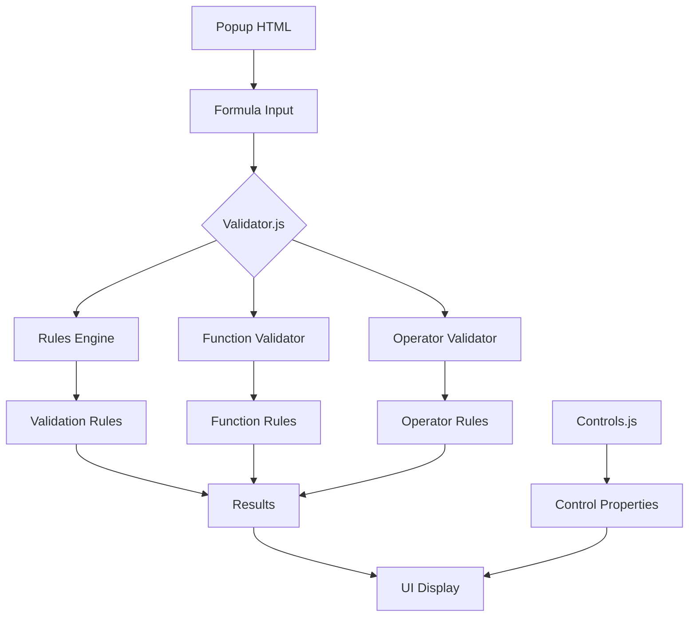

  # PowerFxFormulaChecker
Checks PowerFX formulae, provides a formula explanation and breakdown, explains controls and associated formulae

A Edge browser extension for validating and analyzing Power FX formulae used in Power Apps, explains deeply and directly nested complex formula including operator usage.

# Work in progress Feature(s) 
- Syntax constraints and usage limitations
- Specific formula suggestions based on user input context
- Scroll bar horizontal for larger formula breakdowns

## Core Components



### 1. Validator Engine (validator.js)
Primary validation logic handling:
- Formula parsing and tokenization
- Syntax checking
- Function validation
- Operator validation
- Performance analysis
- Delegation warnings

Dependencies:
- rules.js: Contains function and operator rules
- controls.js: Control-specific validations

### 2. Rules Engine (rules.js)
Contains validation rules for:
- Power FX functions
- Operators
- Data types
- Best practices

Dependencies:
- None (standalone rule definitions)

### 3. Controls Registry (controls.js)
Defines Power Apps controls and their properties:
- Property definitions
- Examples
- Validation rules

Dependencies:
- None (standalone control definitions)

## File Structure
```
powerfxadvanced/
├── popup.html       # Main UI
├── validator.js     # Core validation logic
├── rules.js        # Validation rules
├── controls.js     # Control definitions
├── styles.css      # UI styling
└── manifest.json   # Extension configuration
```

## Dependencies

External:
- None (self-contained extension)

Internal:
- validator.js → rules.js
- validator.js → controls.js
- popup.html → styles.css
- popup.html → validator.js

## Implementation Details

### Validation Process
1. User inputs formula in popup.html
2. validator.js parses and tokenizes formula input
3. Rules are applied from rules.js
4. Control-specific validations from controls.js
5. Results displayed in UI with suggestions

### Error Handling
- Syntax errors
- Function usage errors
- Operator misuse
- Delegation warnings
- Performance implications

## Rule Management

### Rule Sources
The extension's validation rules come from multiple sources:

1. **Built-in Rules** (`rules.js`)
   - Function validation rules
   - Operator rules
   - Data type validation rules
   - Best practices

2. **Microsoft Documentation**
   - Power Apps formula reference
   - Delegation limits
   - Control-specific rules
   - Function behavior documentation


### Function Analysis

1. **Function Categories**
   - Table manipulation (Filter, Sort, GroupBy) etc
   - Text operations (Concat, Replace, Search) etc
   - Mathematic operations (Sum, Average, Round) etc
   - Date/Time functions (DateAdd, TimeValue) etc
   - Behavioral functions (Navigate, Patch) etc

2. **Context Awareness**
   - ThisItem scope in galleries
   - Parent/Self context
   - With/As scope modifications
   - Global/local variable access


### Operator Semantics and Behaviour

1. **Type-Specific Operations**
   - Numeric operators (+, -, *, /, ^)
   - String concatenation (&)
   - Logical operators (&&, ||, !)
   - Comparison operators (=, <>, <, >, <=, >=)

2. **Operator Precedence**

   High -> Low Priority
   1. Parentheses ()
   2. Unary operators (-, !)
   3. Power (^)
   4. Multiply, Divide (*, /)
   5. Add, Subtract (+, -)
   6. Concatenation (&)
   7. Comparison (<, >, <=, >=)
   8. Equality (=, <>)
   9. Logical AND (&&)
   10. Logical OR (||)
