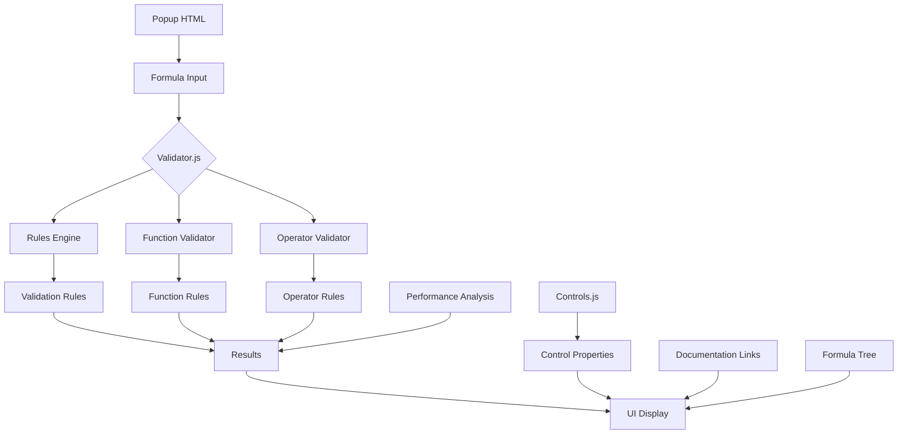

# PowerFxFormulaChecker
A browser extension for validating, analyzing and explaining Power FX formulae used in Power Apps, providing visuals for complex nested formulas. Allowing the user to understand deeply nested PowerFx.

## Features
- Formula validation and analysis
- Function and operator syntax checking
- Documentation link integration for Power FX functions
- Real-time formula explanation and breakdown
- Performance and delegation analysis
- Best practices suggestions
- Control property validation
- Formula tree visualization

## Work in Progress Features
- Syntax constraints and usage limitations
- Context-aware formula suggestions
- Performance optimization warnings
- Style suggestions improvements
- Extended function coverage
- Custom rule creation

## Core Components



### 1. Validator Engine (validator.js)
Primary validation logic handling:
- Formula lexical analysis and tokenization
- Syntax  error checking
- Function and operator validation
- Performance impact analysis
- Delegation rule checking
- Control property validation
- Documentation link mapping

Dependencies:
- rules.js: Validation rules
- controls.js: Control definitions

### 2. Rules Engine (rules.js)
Contains validation rules for:
- Power FX functions
- Operators
- Data types
- Best practices

Dependencies: None

### 3. Controls Registry (controls.js)
Defines Power Apps controls and their properties:
- Property definitions and types
- Valid formula patterns
- Examples and usage
- Default values
- Validation constraints

Dependencies: None

## File Structure
```
powerFxFormulaChecker/
├── popup.html       # Main extension UI
├── validator.js     # Core validation engine
├── rules.js        # Function and operator rules
├── controls.js     # Control definitions
├── styles.css      # UI styling
├── formula-tree.js # Tree visualization
├── formula-tree.html # Tree view
└── manifest.json   # Extension configuration
```

## Dependencies

External:
- None (self-contained extension)

Internal:
- validator.js → rules.js
- validator.js → controls.js
- popup.html → styles.css
- popup.html → validator.js
- formula-tree.html → formula-tree.js

## Implementation Details

### Validation Process
1. User inputs formula in popup.html
2. validator.js tokenizes and parses input
3. Rules applied from rules.js
4. Control validations from controls.js
5. Performance analysis conducted
6. Results displayed with suggestions
7. Documentation links provided
8. Formula tree visualization generated

### Error Handling
- Syntax errors with position information
- Function usage errors
- Operator misuse
- Type mismatch identification
- Delegation warnings
- Performance impact warnings
- Nested formula analysis

## Rule Management

### Rule Sources
The extension's validation rules come from multiple sources:

1. **Built-in Rules** (`rules.js`)
   - Function validation rules
   - Operator rules
   - Data type validation rules
   - Best practices

2. **Microsoft Documentation**
   - Power Apps formula reference
   - Delegation limits
   - Control-specific rules
   - Function behavior documentation

### Function Analysis

1. **Function Categories**
   - Table manipulation (Filter, Sort, GroupBy) etc
   - Text operations (Concat, Replace, Search) etc
   - Mathematical functions (Sum, Average, Round) etc
   - Date/Time handling (DateAdd, TimeValue) etc
   - Behavioral functions (Navigate, Patch) etc
   - Collection operations
   - Data operations
   - Type conversion
   - Controls and navigation

2. **Context Awareness**
   - ThisItem scope in galleries
   - Parent/Self context
   - With/As scope modifications
   - Global/local variable access

### Operator Semantics

1. **Type-Specific Operations**
   - Numeric operations
   - String manipulation
   - Logical operations
   - Comparison operations
   - Collection operations
   - Date/Time operations

2. **Operator Precedence**

   High → Low Priority
   1. Parentheses ()
   2. Unary operators
   3. Power (^)
   4. Multiply, Divide (*, /)
   5. Add, Subtract (+, -)
   6. Concatenation (&)
   7. Comparison (<, >, <=, >=)
   8. Equality (=, <>)
   9. Logical AND (&&)
   10. Logical OR (||)
